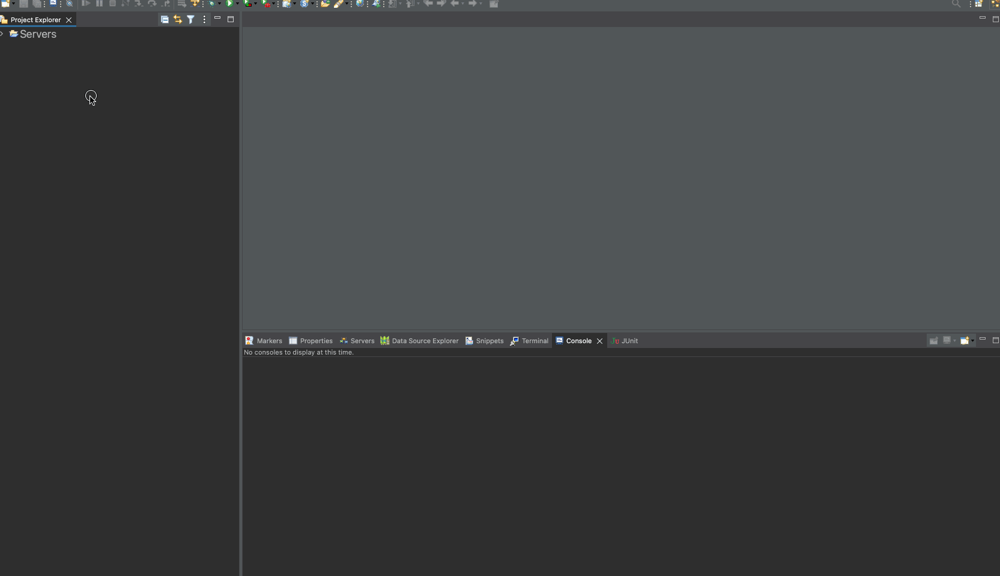
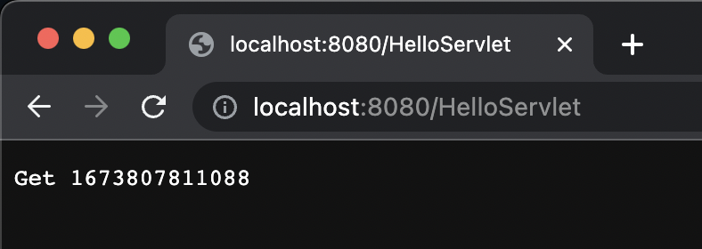

### Import To Eclipse Java EE Edition

1. Download the zip of this repo and unzip it.

2. Import the project into eclipse as a maven project.

   

3. Config Run for development.

   

4. Config Run for Deployment

   

5. Access servlet.

   

   As you have the servlet at `org.example.controller.HelloServlet.java`.


### CMD

#### To develop the project.

``` bash 
mvn jetty:run
```

> The server config for development is at `pom.xml:86`.
>
> Feel free to configure it.


#### To deploy the project.

``` bash
mvn clean install exec:exec
```
> The server config for deployment is in `org.example.EmbeddingJettyStarter`.
>
> Feel free to configure it.


### Configuration of Jetty

#### Configure in coding

In `org.example.EmbeddingJettyStarter`, you can directly change the port or the context path by:

``` java
Server server = new Server(8080);		// change the port number 
// ...
context.setContextPath("/new_context");   // change the context path
// ...
```


#### Configure by pom.xml plugin settings

In `org.example.EmbeddingJettyStarter`, I leave the interface of taking the argument from plugin settings:

``` java
int port = 8080;
StringBuilder contextPath = new StringBuilder("/");

for (String arg: args) {
  final String[] split = arg.split("=");
  if (split[0].equals("--port")) {
    port = Integer.parseInt(split[1]);
  }
  if (split[0].equals("--context")) {
    contextPath.append(split[1]);
  }
}
```

So, if you have configure in `pom.xml`:

``` xml
<!-- jetty plugin for deployment -->
<plugin>
  <groupId>org.codehaus.mojo</groupId>
  <artifactId>exec-maven-plugin</artifactId>
  <version>3.1.0</version>
  <configuration>
    <classpathScope>test</classpathScope>
    <executable>java</executable>
    <arguments>
      <argument>-cp</argument>
      <classpath />
      <!-- 5. point to the starter -->
      <argument>org.example.EmbeddingJettyStarter</argument>
      
      <!-- port argument  -->
      <argument>--port=8080</argument>		
      
      <!-- context argument (no root in the front) -->
      <argument>--context=coen6317</argument>
    </arguments>
  </configuration>
</plugin>
```

Then you can access the servlet by:

http://localhost:8080/coen6317/HelloServlet

At the same time, please make sure your servlet's annotation value mapping is valid for the context path:

``` java
@WebServlet(name = "HelloServlet", value = "HelloServlet")
```

Do not add the root in the front:

``` java
@WebServlet(name = "HelloServlet", value = "/HelloServlet")
```

